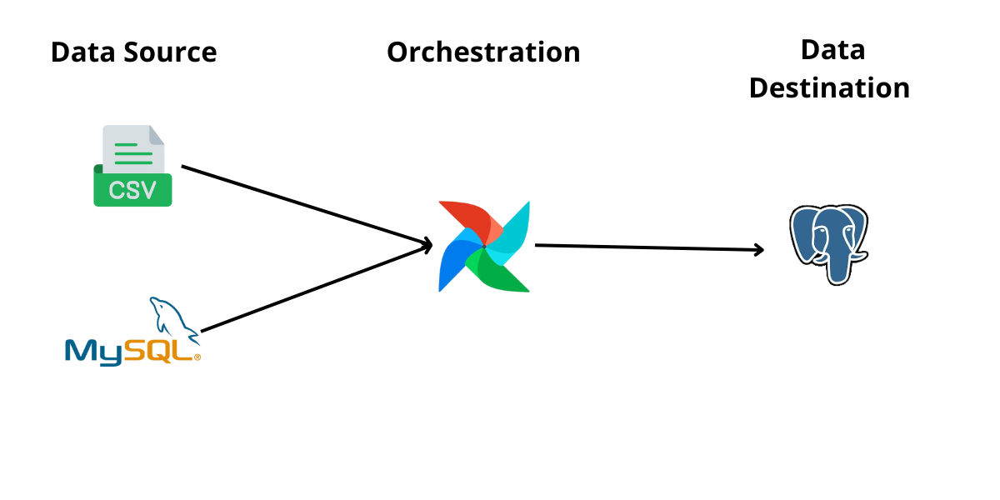
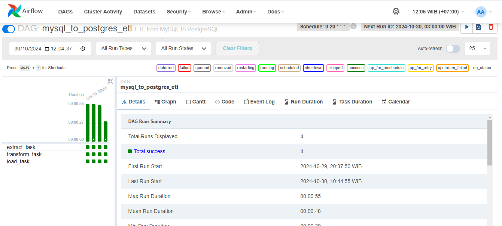
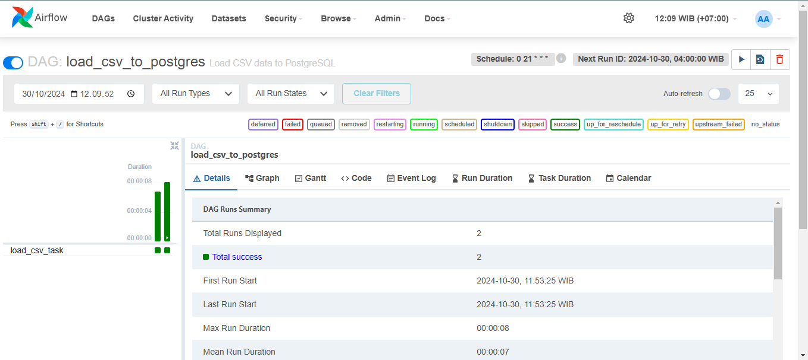

# etl-dealer
## Summary
This project is an ETL design that integrates data from MySQL and CSV sources. Utilizing Airflow as the orchestration tool and PostgreSQL as the data destination, this project aims to optimize the data processing and analysis workflow efficiently.

## Tech stack Used:
1. Python
2. Docker
3. Mysql
4. Postgre
5. Airflow

## This is the data pipeline design implemented in this project.


## Set Up Airflow With Docker Compose
First, you can clone the repository by executing the following command.
```
git clone https://github.com/awinardi1004/etl-dealer.git
````
Next, you can run Docker Compose using the following command
```
docker compose up
```
Then open localhost:8080 to access Airflow.
```
Username: airflow
Password: airflow
```
## Create DAG
Before creating a DAG script, you need to establish connections to link PostgreSQL and MySQL. Next, navigate to the data directory and create a file `named name_file.py`. After that, you can trigger your DAG to check if it is running correctly.

You can view the code [here.](dags/msql_to_pg.py)

You can view the code [here.](dags/csv_to_pg.py)